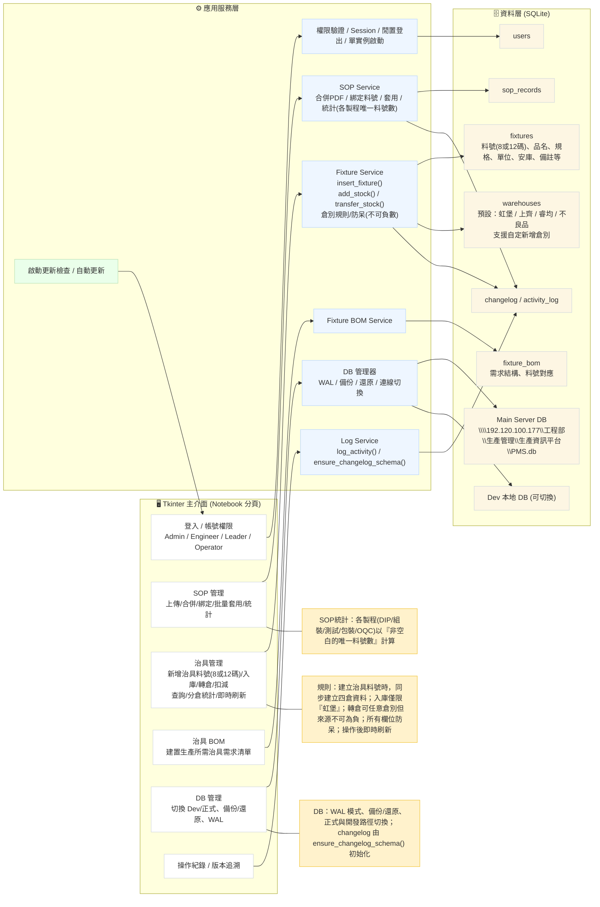
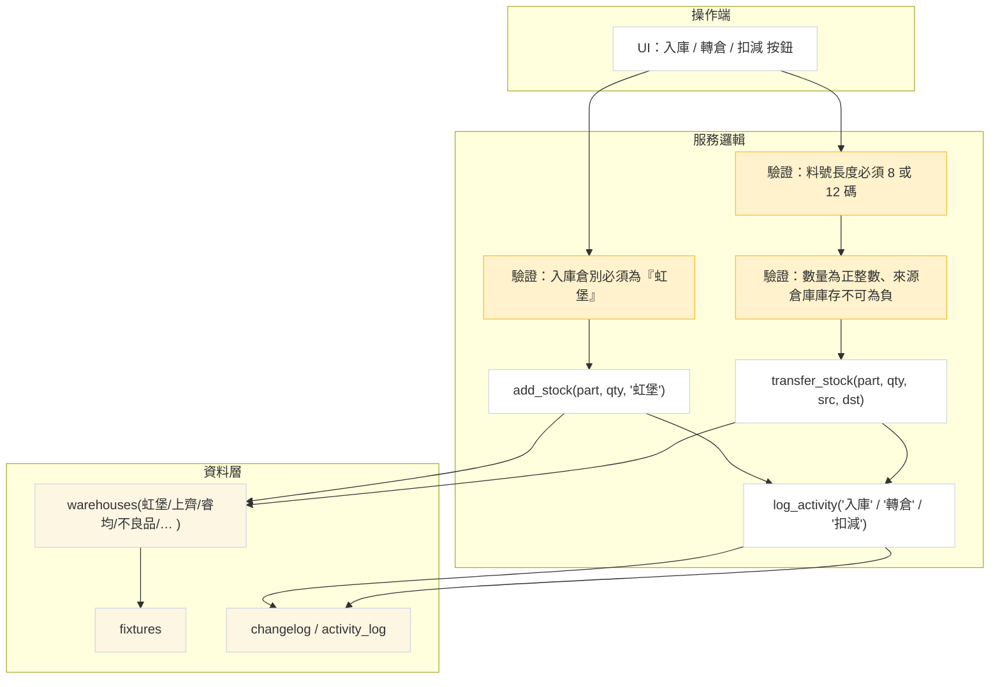

# PMS + 治具管理：整體架構圖

> 本文件包含兩張 Mermaid 圖：**系統總覽** 與 **庫存操作細節**。  
> 可將此檔丟到 Mermaid Live Editor 或直接使用下方 HTML 版本檔案瀏覽。

## 1) 系統總覽 (Overview)



---

## 2) 庫存操作細節 (Stock Operations)



---

## 備用：PlantUML 版本

```
@startuml
left to right direction
skinparam componentStyle rectangle
skinparam shadowing false
skinparam linetype ortho

package "UI (Tkinter - Notebook)" {
  [Login/ACL]
  [SOP 管理]
  [治具管理]
  [治具 BOM]
  [DB 管理]
  [操作紀錄視圖]
}

package "Services" {
  [Auth Service]
  [SOP Service]
  [Fixture Service]
  [Fixture BOM Service]
  [Log Service]
  [DB Manager]
  [Updater]
}

database "SQLite (WAL)" {
  [users]
  [sop_records]
  [warehouses]
  [fixtures]
  [fixture_bom]
  [changelog/activity_log]
}

[Login/ACL] --> [Auth Service]
[SOP 管理] --> [SOP Service]
[治具管理] --> [Fixture Service]
[治具 BOM] --> [Fixture BOM Service]
[DB 管理] --> [DB Manager]
[操作紀錄視圖] --> [Log Service]

[Auth Service] --> [users]
[SOP Service] --> [sop_records]
[SOP Service] --> [changelog/activity_log]
[Fixture Service] --> [fixtures]
[Fixture Service] --> [warehouses]
[Fixture Service] --> [changelog/activity_log]
[Fixture BOM Service] --> [fixture_bom]
[DB Manager] --> [users]
[DB Manager] --> [sop_records]
[DB Manager] --> [warehouses]
[DB Manager] --> [fixtures]
[DB Manager] --> [fixture_bom]
[DB Manager] --> [changelog/activity_log]

note right of [Fixture Service]
  - insert_fixture()
  - add_stock()  (only '虹堡')
  - transfer_stock() (any-to-any, non-negative)
  - 防呆：料號 8/12 碼、不可負數
end note

note right of [SOP Service]
  合併/綁定/批量套用；
  統計以各製程(DIP/組裝/測試/包裝/OQC)
  的「非空白唯一料號數」計算
end note

note bottom of [DB Manager]
  DB 切換：Dev <-> Main Server
  Main DB: \\\\192.120.100.177\\工程部\\生產管理\\生產資訊平台\\PMS.db
  ensure_changelog_schema() 初始化
end note
@enduml
```